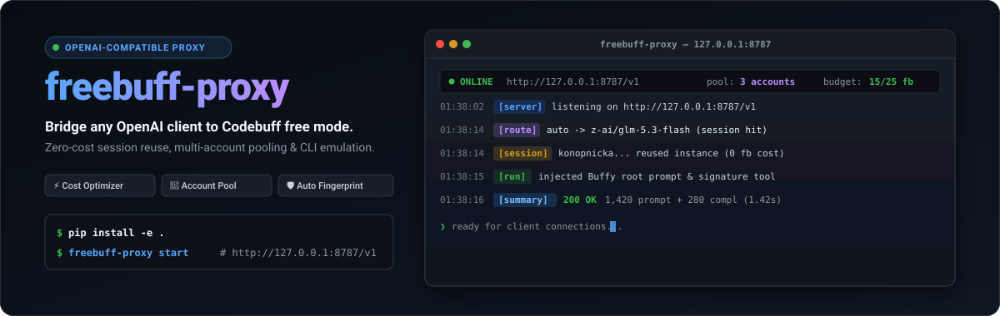
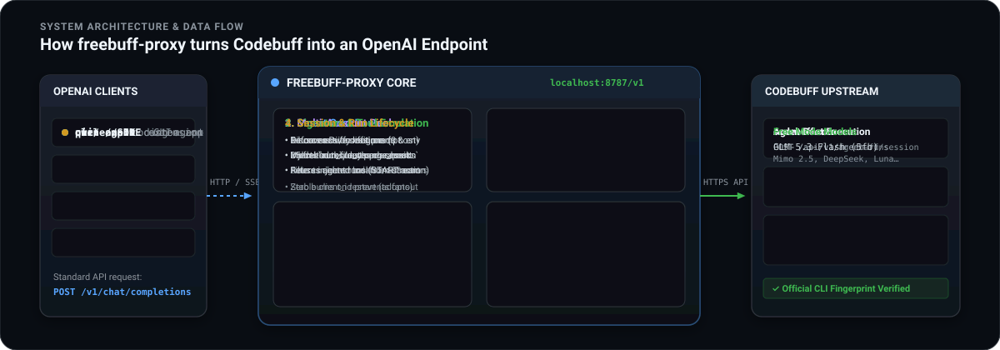

<p align="center">
  
</p>

<p align="center">
  <a href="#license"></a>
  <a href="https://www.python.org/downloads/"></a>
  
  
  
</p>

---

## Overview

**freebuff-proxy** is an OpenAI-compatible reverse proxy for **Codebuff free mode** (`codebuff.com`). It allows any standard OpenAI client — [pi](https://github.com/badlogic/pi), [omp](https://github.com/can1357/oh-my-pi), [qwen-agent](https://github.com/QwenLM/Qwen-Agent), [cline](https://github.com/cline/cline), [continue](https://github.com/continuedev/continue), Python `openai` SDK, or `curl` — to interact directly with Codebuff's free-mode models without modification.

Upstream Codebuff strictly validates requests and enforces restrictions that off-the-shelf OpenAI clients cannot satisfy natively:
1. **Official CLI Signature**: Requests must start with the canonical system prompt and provide signature tool definitions.
2. **Session Admission**: Models require admission with daily freebucks, scoped to one active session per account for 1 hour.
3. **Run ID Fanout Limits**: Upstream tracks client IDs per run, throwing `403 free_mode_run_fanout` if multiple clients hit the same run.
4. **Hardware Fingerprint Bans**: Accounts sharing hardware signatures risk collective bans.

**freebuff-proxy** bridges this gap by managing sessions, rotating accounts, generating isolated hardware fingerprints, emulating CLI signatures, and routing requests to minimize allowance consumption.

---

## Architecture & How It Works

<p align="center">
  
</p>

### 1. Request Transformation & Signature Emulation
Codebuff rejects calls that do not mimic its official terminal client:
- **Root Opening Prompt**: Ensures the first system message opens with `You are Buffy, the coding agent behind Codebuff.`. If a client specifies custom instructions, the proxy prepends Buffy's identity while preserving user prompts.
- **Tool Signature Injection**: If client tools omit Codebuff-specific signatures, the proxy transparently injects `run_file_change_hooks`.
- **Stream Scrubbing**: When streaming server-sent events (`stream=True`), the proxy strips injected tool call chunks before forwarding delta frames to the client.
- **Client Fanout Protection**: Maintains stable `client_id` identifiers per agent run to avoid triggering upstream fanout limits.

### 2. Multi-Account Pooling
The proxy pools freebuff accounts from multiple local sources:
- `~/.config/freebuff-proxy/accounts.json` (managed via `freebuff-proxy --add-account`)
- `FREEBUFF_TOKENS` or `FREEBUFF_TOKEN` environment variables
- `~/.config/manicode/credentials.json` (Codebuff CLI credentials)
- `~/.config/freebuff-desktop/state.json` (Codebuff Desktop state)

All accounts are deduplicated by email/token. Each account contributes its own **25 freebucks/day** allowance, giving $N \times 25$ daily freebucks and $N$ concurrent active sessions across the pool.

### 3. Isolated Hardware Fingerprints
Official Codebuff logins derive an identity from hardware inventory. Reusing a single fingerprint across accounts can lead to collective bans (`403 {"status":"banned"}`).
- When running `freebuff-proxy --add-account`, the proxy mints a cryptographically random, collision-checked `enhanced-...` fingerprint (32-byte base64url).
- Every account in the pool retains its own unique fingerprint identity.

### 4. Smart Cost Routing
Session admission costs freebucks (5–50 freebucks depending on model), but **an active session serves unlimited requests for 1 hour at zero cost**:
- **Session Reuse (Free)**: If a live session exists for the requested model, the router reuses it.
- **Auto Model Selection**: When `model: "auto"` is requested, the router reuses any active session before spending allowance. If no session is open, it admits the cheapest available model.
- **Richest Account Priority**: New admissions are dispatched to the account with the highest remaining freebucks, preventing premature drain of any single account.
- **Graceful Failover**: If an account returns `402` (exhausted) or `403` (cooldown/banned), it is cooled for 60 seconds and the request immediately fails over to the next candidate.

---

## Installation

### With pip (editable)

```bash
git clone https://github.com/adrian/freebuff-proxy.git
cd freebuff-proxy
pip install -e .
```

### With requirements.txt

```bash
pip install -r requirements.txt
python3 server.py --help
```

---

## Quick Start

```bash
# 1. Add your first account via interactive browser login
freebuff-proxy --add-account

# 2. Verify account status and freebucks balance
freebuff-proxy --accounts

# 3. Start proxy daemon in background
freebuff-proxy start

# 4. Inspect live metrics and counters
freebuff-proxy stats

# 5. Stop background daemon
freebuff-proxy stop
```

---

## CLI Command Reference

The `freebuff-proxy` command provides a full-featured terminal interface built with Rich:

```bash
Usage: freebuff-proxy [OPTIONS] [COMMAND] [ARGS]...

Options:
  --cli          Enable rich debug logs in terminal.
  --selftest     Run internal self-test suite and exit.
  --add-account  Interactive device login to add account to pool.
  --accounts     List accounts in the pool with budget and fingerprint status.
  --help         Show this message and exit.

Commands:
  serve          Run proxy server in foreground.
  start          Start proxy daemon in background.
  stats          Display formatted usage and session tables.
  stop           Stop running background daemon.
```

### Foreground Serve
```bash
freebuff-proxy                # default: http://127.0.0.1:8787/v1
freebuff-proxy --cli          # verbose mode: displays token counts, routing choices, SSE deltas
```

### Background Daemon
```bash
freebuff-proxy start          # writes PID to server.pid, logs to server.log
freebuff-proxy start --cli    # daemon with verbose logging
freebuff-proxy stop           # sends SIGTERM, verifies exit, cleans PID
```

### Live Statistics (`stats`)
Displays three Rich tables:
1. **Proxy Summary**: Server state, total requests, prompt/completion tokens, errors.
2. **Model Usage**: Per-model request count, prompt tokens, completion tokens, totals.
3. **Account Usage & Status**: Per-account requests, tokens, live budget, active session, cooldown state.

```bash
freebuff-proxy stats
```

### Account Pool Management (`--accounts`, `--add-account`)
```bash
# Interactive browser login (creates dedicated random fingerprint)
freebuff-proxy --add-account

# View all pooled accounts, balances, reset times, and duplicate warnings
freebuff-proxy --accounts
```

---

## Model Pricing & Routing

Upstream admission spends freebucks per model for a 1-hour session:

| Model ID | Aliases | Admission Cost | Quality / Speed |
|---|---|:---:|---|
| `z-ai/glm-5.3-flash` | `glm-5.3-flash` | **5 freebucks** | Very fast, high coding capability |
| `crof/kimi-k3-eco` | `kimi-k3-eco` | **5 freebucks** | Balanced cost and context length |
| `mimo/mimo-v2.5` | `mimo-v2.5` | **10 freebucks** | Strong instruction following |
| `upstage/solar-pro4` | `solar-pro4` | **10 freebucks** | Fast completion |
| `deepseek/deepseek-v4-flash` | `deepseek-v4-flash` | **15 freebucks** | DeepSeek reasoning architecture |
| `meta/muse-spark-1.2-contributor` | `muse-spark-1.2` | **15 freebucks** | Open-weights derivative |
| `openai/gpt-5.6-luna` | `gpt-5.6-luna`, `luna` | **20 freebucks** | High-precision coding |
| `google/gemini-3.8-flash` | `gemini-3.8-flash` | **50 freebucks** | Maximum capability tier |
| `auto` | `default`, `""` | **Cheapest / Free** | **Reuses open session; otherwise admits 5fb tier** |

*Note: Models not in the free price list (e.g. `z-ai/glm-5.2`, `minimax/minimax-m3`) pass through unpriced and are not auto-selected by `auto`.*

---

## Client Configuration

### 1. `pi` Coding Agent
Edit `~/.pi/agent/models.json`:

```json
{
  "providers": {
    "freebuff": {
      "baseUrl": "http://127.0.0.1:8787/v1",
      "api": "openai-completions",
      "apiKey": "freebuff",
      "authHeader": true,
      "models": [
        { "id": "auto", "name": "[freebuff] auto (cheapest reuse)" },
        { "id": "glm-5.3-flash", "name": "[freebuff] glm-5.3-flash" },
        { "id": "mimo-v2.5", "name": "[freebuff] mimo-v2.5" }
      ]
    }
  }
}
```

```bash
pi -p "Write a quicksort in Python" --model freebuff/auto
```

### 2. `omp` (Oh My Pi)
Edit `~/.omp/agent/models.yml`:

```yaml
providers:
  freebuff:
    baseUrl: http://127.0.0.1:8787/v1
    api: openai-completions
    apiKey: freebuff
    authHeader: true
    models:
      - id: auto
        name: "[freebuff] auto"
      - id: glm-5.3-flash
        name: "[freebuff] glm-5.3-flash"
```

```bash
omp -p "explain async/await in rust" --model=freebuff/auto
```

### 3. `qwen-agent`
Edit `~/.qwen/settings.json` under `modelProviders.openai`:

```json
{
  "id": "z-ai/glm-5.3-flash",
  "name": "[freebuff] glm-5.3-flash",
  "baseUrl": "http://127.0.0.1:8787/v1",
  "envKey": "FREEBUFF_API_KEY"
}
```

```bash
FREEBUFF_API_KEY=dummy qwen --auth-type=openai -m auto -p "review git diff"
```

### 4. Official Python OpenAI SDK
```python
from openai import OpenAI

client = OpenAI(
    base_url="http://127.0.0.1:8787/v1",
    api_key="freebuff",  # any non-empty string
)

response = client.chat.completions.create(
    model="auto",
    messages=[
        {"role": "system", "content": "You are an expert Python engineer."},
        {"role": "user", "content": "How do memory views work in Python?"}
    ],
    stream=True,
)

for chunk in response:
    content = chunk.choices[0].delta.content or ""
    print(content, end="", flush=True)
```

### 5. `curl`
```bash
curl -X POST http://127.0.0.1:8787/v1/chat/completions \
  -H "Content-Type: application/json" \
  -d '{
    "model": "auto",
    "messages": [{"role": "user", "content": "Ping!"}]
  }'
```

---

## API Endpoints

| Method | Path | Description |
|---|---|---|
| `GET` | `/v1/models` | List all available freebuff models and fallback cost hints. |
| `POST` | `/v1/chat/completions` | Standard OpenAI completion endpoint (streaming and non-streaming). |
| `GET` | `/health` | Health check endpoint returning server status and model roster. |
| `GET` | `/status` | Live snapshot of account budgets, active sessions, and cooldown timers. |
| `GET` | `/stats` | Cumulative counters for requests, errors, prompt/completion tokens. |

---

## Environment Variables

| Variable | Default | Purpose |
|---|---|---|
| `HOST` | `127.0.0.1` | Network interface to bind proxy server. |
| `PORT` | `8787` | TCP port to listen on. |
| `FREEBUFF_BASE` | `https://www.codebuff.com` | Upstream Codebuff API host. |
| `FREEBUFF_APP_URL` | `https://freebuff.com` | Product UI host used for `--add-account` browser auth. |
| `FREEBUFF_ACCOUNTS` | `~/.config/freebuff-proxy/accounts.json` | Account credentials storage file (`chmod 600`). |
| `FREEBUFF_TOKENS` | `""` | Space-separated list of authentication tokens to pool. |
| `FREEBUFF_TIMEOUT` | `900` | Upstream HTTP socket timeout in seconds. |
| `FREEBUFF_COOLDOWN`| `60` | Duration (seconds) to cool an account on 402/403/409 errors. |

---

## Known Limits

- **Daily Allowance**: Codebuff grants 25 freebucks per day per account. Reset times are shown in `freebuff-proxy stats` and `/status`.
- **Single Concurrent Session**: Each account can maintain only one active session at a time. Requesting a different model releases the previous session and admits the new one. Use `auto` to maximize session reuse.
- **Free Mode Bans**: Upstream bans apply to free mode specifically (`403 {"status":"banned"}`) while leaving account login valid (`/api/v1/me` returns 200). The proxy detects banned accounts during startup and pool refreshes, excluding them automatically.

---

## License

This project is licensed under the [MIT License](LICENSE).
